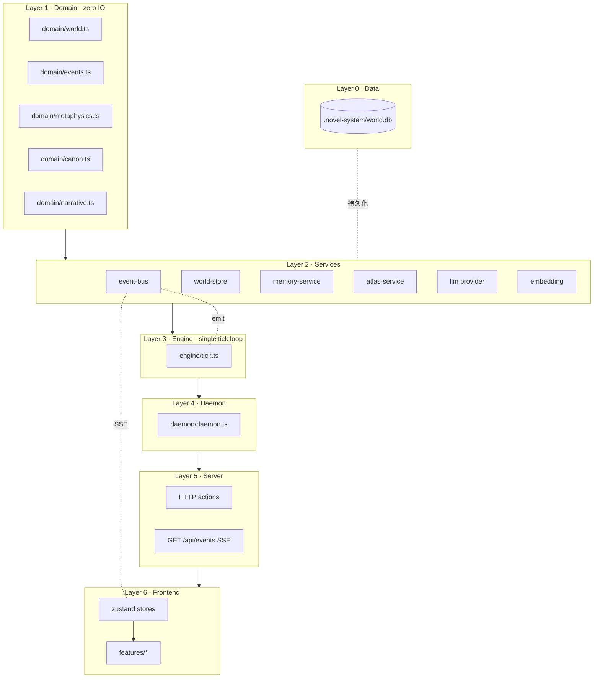
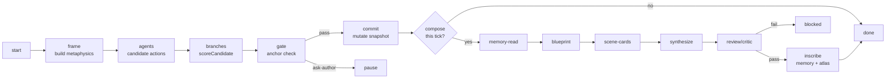

# Novel System v3 · 架构

## 一句话

世界历史模拟器为核心 + 八字奇门作为概率先验 + 章节文本是模拟的副产品。
单 tick 循环驱动一切；WorldEvent 是唯一真相；单 SQLite + SSE 单流。

## 分层



## Tick pipeline

每一次 daemon tick 都按下面这条流水线跑：



每个节点都 emit 一条 WorldEvent。前端 UI 拿 SSE 流自己挑显示哪些。

## SQLite 表

`.novel-system/world.db` 一个文件，12 张表：

| 表 | 内容 |
|---|---|
| `_meta` | schema 版本 + 任意 key/value |
| `events` | WorldEvent log，append-only，幂等 by id |
| `runs` | 每 tick 一行 |
| `world_state` | 最新 snapshot per worldId |
| `world_history` | 已提交的 stages |
| `chapters` | 章节草稿 + 场景卡 |
| `memory_entries` + `memory_fts` | 记忆 + FTS5 (trigram) 镜像 |
| `atlas_nodes` | 派生的 markdown 树 |
| `metaphysics_frames` | 每 tick 一帧（审计用） |
| `checkpoints` | tick + phase checkpoint |
| `ai_settings` | DeepSeek 配置（替代旧 studio-config.json） |

## 事件词典

`subsystem` 用统一动词：

| Subsystem | 动词 | 用途 |
|---|---|---|
| runtime | 推演 | tick 生命周期 |
| frame | 起卦 | metaphysics frame built |
| agents | 心动 | 角色 reflection/plan |
| branches | 分流 | candidate scored |
| gate | 裁决 | canon decision |
| commit | 落定 | snapshot mutated |
| compose | 成文 (+ 6 子动词) | chapter pipeline |
| memory | 落册 | memory write |
| atlas | 结图 | atlas (re)compile |
| promotion | 扶正 | branch promoted to canon |
| pause | 驻笔 | daemon paused |
| qimen | 转盘 | qimen pattern shift |

`severity`：`ambient` / `notable` / `decision-required`。前端 WorldEchoes 默认只显示后两类。

## Metaphysics-as-prior

`metaphysics/frame.ts` 收集八字 (`bazi`) / 奇门 (`qimen`) / 八卦 (`bagua`) 三层输出，生成 `MetaphysicsFrame.influences[]`。

`metaphysics/prior.ts.scoreCandidate(candidate, frame)`：
- 把 character / location / branch / relationship 维度的 influences 投射到候选 action
- 每条 influence 的 push 上限 0.25 × confidence 折扣
- 对立轴（initiative↔delay 等）做负向推
- 加上 fortune favorability 偏置
- 返回 0..1 权重 + 可解释打分 + contributingInfluences[] 列表

引擎集成位置：`engine/phases/branches.ts` 调用 `scoreCandidates(...)`，输出按权重排序的候选；`engine/phases/gate.ts` 看 chosen.weight + anchor 违规 → promote / archive-only / ask-author。

## 失败隔离

- `event-bus.append` 内部 try/catch；emit 失败永远不冒泡到业务路径
- `runTick` try/catch；崩溃记 `runs.status='failed'` + emit `runtime/failed`
- Tick 是原子单位；跨 phase 失败不写半 commit

## 跑通的 e2e

```bash
npm run sandbox
```

输出：daemon 状态 + 事件计数（按 subsystem 分桶）+ 章节数 + metaphysics frame 数。验证整条流水线 e2e 联通。
